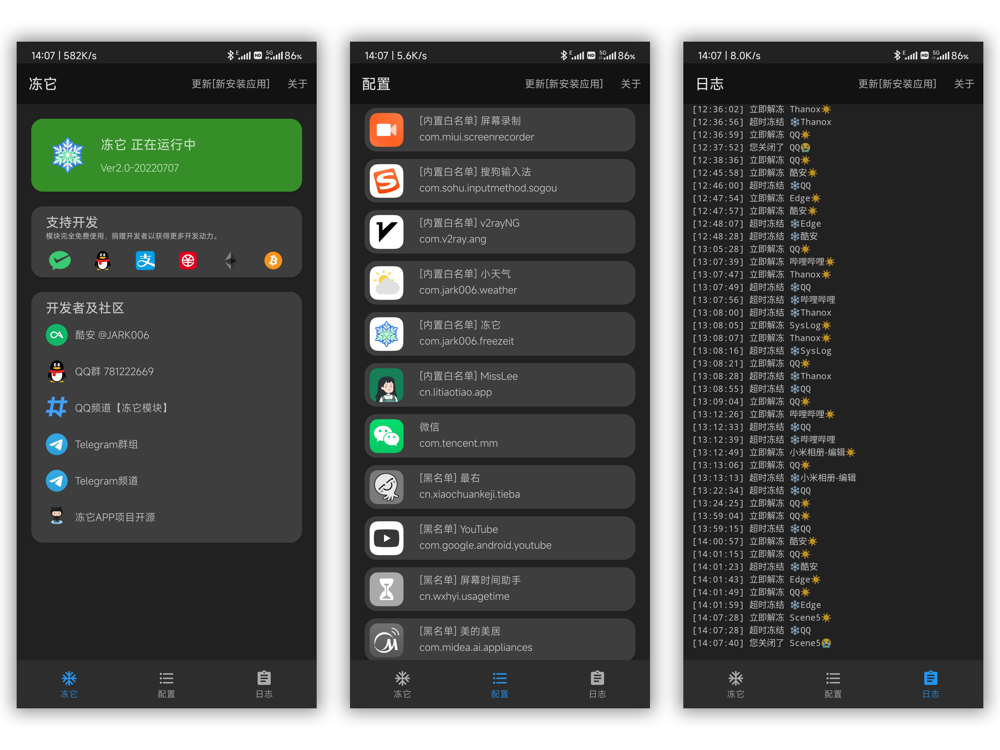

# 冻它模块 APP freezeitapp

**[面具模块]** 模拟墓碑后台机制，自动暂停第三方应用后台运行。

**[MagiskModule]** Emulate the Tombstone mechanism to automatically suspend third-party apps running in the background. 

---

[教程 Tutorials](https://jark006.github.io/FreezeitIntroduction/)

[酷安 @JARK006](https://www.coolapk.com/u/1212220) 

[Magisk模块发布页](https://github.com/jark006/freezeitRelease)

[QQ群组 781222669](https://jq.qq.com/?_wv=1027&k=Q5aVUglt)
[Telegram Group 群组](https://t.me/+sjDX1oTk31ZmYjY1) [Channel 频道](https://t.me/freezeitRelease)
[蓝奏云](https://jark006.lanzout.com/b017oz9if) 密码: dy6i

---

